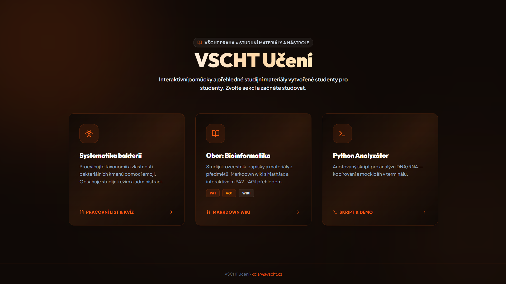
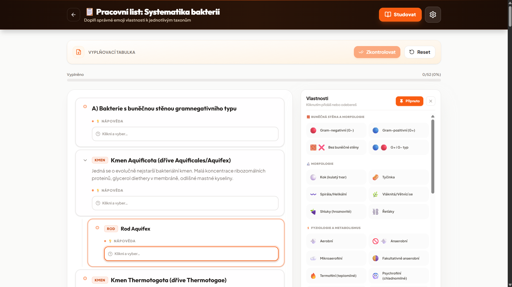
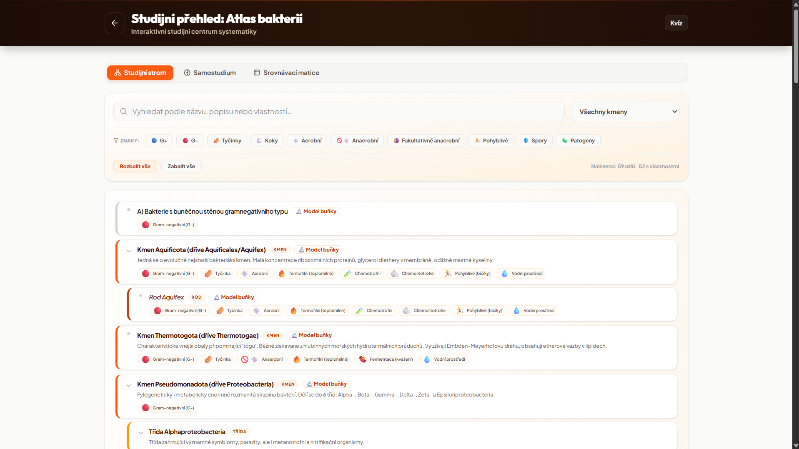
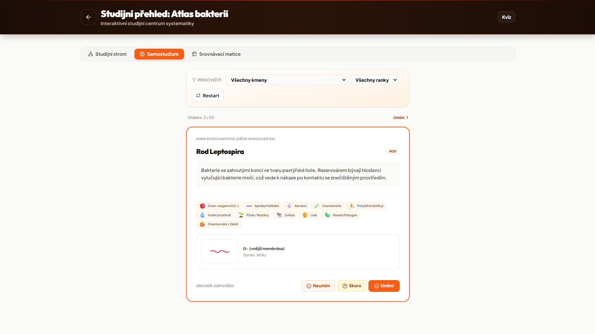
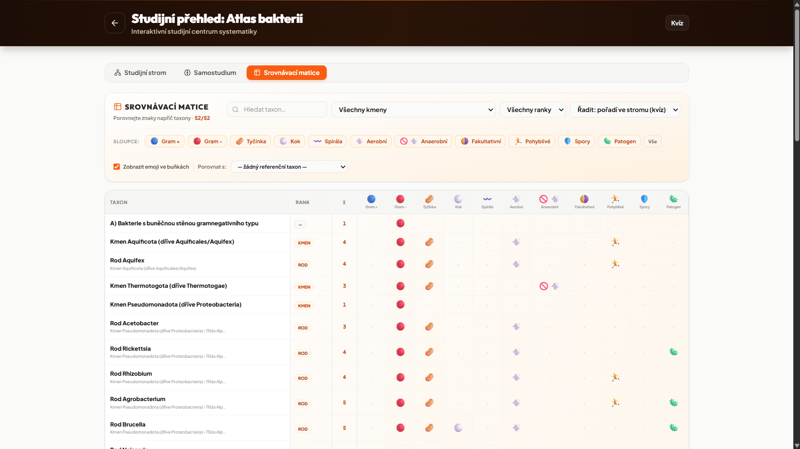
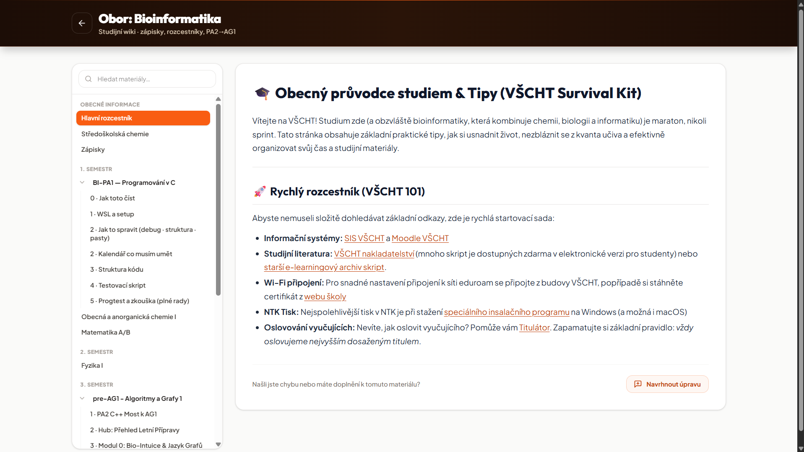
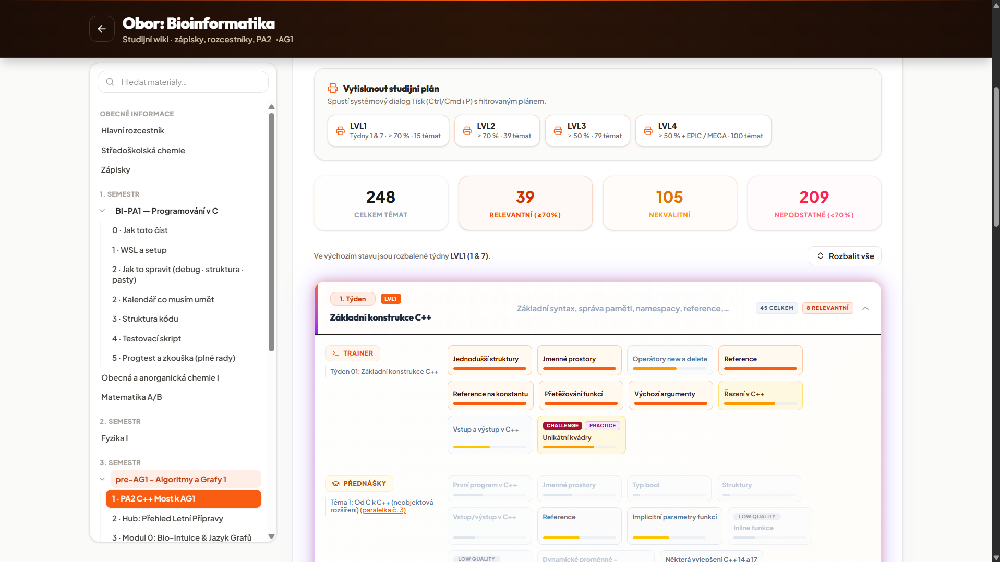

# 🧪 VŠCHT Učení

Studijní portál pro studenty **VŠCHT Praha (UCT Prague)** — moderní Web Application spojující interaktivní studijní moduly a nástroje:

1. 🦠 **Systematika bakterií** — interaktivní emoji kvíz, pracovní list, taxonomický atlas, kartičky a srovnávací matice.
2. 📚 **Obor: Bioinformatika** — komunitní Markdown wiki s podporou MathJax, přehledem předmětů a průvodcem studia (PA2→AG1).
3. 🐍 **Python Analyzátor** — anotovaný skript pro bioinformatickou analýzu DNA/RNA sekvencí s živým simulovaným během.

---

## 📸 Ukázky aplikace (Screenshots)

### 🏠 Hlavní rozcestník (Landing Page)


### 🦠 Systematika bakterií — Pracovní list a Kvíz


### 🌳 Atlas bakterií — Taxonomický studijní strom


### 🟨 Systematika bakterií — Kartičky (Samostudium)


### 📊 Systematika bakterií — Srovnávací matice


### 📚 Obor Bioinformatika — Studijní Wiki


### ⭐ Bioinformatika Wiki — Hodnocení obsahu


---

## ⚡ Rychlý start (Quick Start)

Před spuštěním se ujistěte, že máte nainstalovaný balíčkovací manažer **pnpm**.

```bash
pnpm install
pnpm dev        # Spustí vývojový server na http://localhost:34020
pnpm build      # Provede typovou kontrolu (tsc) a produkční build do dist/
pnpm typecheck  # Samostatná kontrola TypeScript typů
pnpm preview    # Náhled produkčního buildu
```

---

## 🛠️ Technický Stack

| Vrstva | Technologie | Popis |
|---|---|---|
| **UI Framework** | React 19 + TypeScript | Komponentová architektura s typovou bezpečností |
| **Bundler** | Vite 6 | Multi-chunk lazy loading podle tras (code splitting) |
| **Styling** | Tailwind CSS 4 | Custom design systém s `@theme` tokeny (vřelé espresso a zářivě oranžová `#f95d12`) |
| **Routing** | React Router 7 | Klientské směrování SPA |
| **Databáze / Store** | Upstash Redis | Serverless KV úložiště pro sdílení dat a odpovědí kvízu |
| **Markdown & Math** | `react-markdown` + MathJax 3 | Vykreslování matematických vzorců a studijních textů s GFM a rehype-raw |
| **Nasazení** | Vercel | SPA rewrites, Edge API funkce a automatický build pipeline |

---

## 📁 Struktura projektu

```text
src/
├── components/
│   ├── ui/               # Znovupoužitelné UI komponenty (Button, Card, Badge, ProgressBar...)
│   └── layout/           # Základní PageShell a rozvržení stránek
├── pages/
│   └── HomePage.tsx      # Hlavní rozcestník modulů
└── features/
    ├── microbiology/     # Systematika bakterií (kvíz, strom, kartičky, matice, admin)
    ├── bioinformatics/   # Bioinformatická wiki (články v markdownu, PA2→AG1 přehled)
    └── python-analyzer/  # Python skript prohlížeč a simulovaný terminál
```

---

## 🗺️ Přehled tras (Routes)

| Cesta (Path) | Modul / Funkce | Popis |
|---|---|---|
| `/` | Hlavní rozcestník | Přehledový portál s rychlým vstupem do modulů |
| `/mikrobiologie` | Kvíz a Pracovní list | Procvičování taxonomických vlastností pomocí emoji |
| `/mikrobiologie/studijni-strom` | Taxonomický atlas | Interaktivní strom bakteriálních kmenů a rodů |
| `/mikrobiologie/samostudium` | Kartičky (Flashcards) | Samostudium a opakování vlastností mikroorganismů |
| `/mikrobiologie/srovnavaci-matice` | Srovnávací matice | Tabulkové porovnání charakteristik jednotlivých kmenů |
| `/mikrobiologie/admin` | Správa správných odpovědí | Administrace databáze vlastností a katalogu emoji (Upstash Redis) |
| `/obor-bioinformatika/*` | Bioinformatická Wiki | Studijní zápisky, návody, MathJax vzorce a rady k předmětům |
| `/python-analyza` | Python Analyzátor | Interaktivní prohlížeč skriptu pro analýzu DNA/RNA |

---

## 🎨 Design a Vizuální Identita

- **Akcentní barvy**: Teplá zářivě oranžová `#f95d12` (`text-#c2410c`).
- **Tmavé povrchy**: Espresso tmavé tóny `#0f0906` a hřejivé odstíny hnědé.
- **Typografie**: Plus Jakarta Sans (tělo textu), Outfit (nadpisy), JetBrains Mono / monospace (kód a terminál).
- **Styling**: Čisté mikro-animace, skleněný efekt (glassmorphism) a přehledná vizuální hierarchie.

---

## 💾 Datová architektura a Persistence

- **Mikrobiologie**: Taxonomie a katalog emoji jsou součástí buildu aplikace.
- **Sdílené úložiště**: Upstash Redis přes serverless endpointy `GET/POST /api/get-data` a `/api/save-data`.
- **Záložní režim**: Při výpadku sítě nebo lokálním vývoji se využívá `localStorage`.
- **Administrace**: Přístup chráněn heslem (prostřednictvím proměnné prostředí `MICROBIOLOGY_ADMIN_PASSWORD`).

---

## 🚀 Nasazení & Vývoj (Vercel & GitHub PR Flow)

### Vývojový server a navrhování úprav ve Wiki

Portál obsahuje funkci **„Navrhnout úpravu“** přímo na stránkách Wiki:

1. Uživatel klikne na úpravu návodu/zápisku a odešle změnu.
2. Endpoint `POST /api/suggest-edit` vytvoří větev na GitHubu (`suggest/*`).
3. Automaticky zaloguje změny a otevře **Pull Request** do větve `main` v repositáři [kolardavidcz/vscht-uceni-web](https://github.com/kolardavidcz/vscht-uceni-web).
4. Změny se **nefúzují automaticky** — úpravu schvaluje správce v rozhraní GitHubu.

#### Nastavení GitHub PAT (Personal Access Token)

Pro lokální testování navrhování úprav:
1. Vygenerujte **Fine-grained Personal Access Token** na GitHubu s oprávněními `Contents` (Read/Write) a `Pull requests` (Read/Write) pro repo `vscht-uceni-web`.
2. Uložte token do `.env.local`:
   ```env
   GITHUB_TOKEN=github_pat_...
   ```
3. Na Vercelu přidejte stejný `GITHUB_TOKEN` do **Settings → Environment Variables**.

---

## 📬 Kontakt

[kolarv@vscht.cz](mailto:kolarv@vscht.cz)
